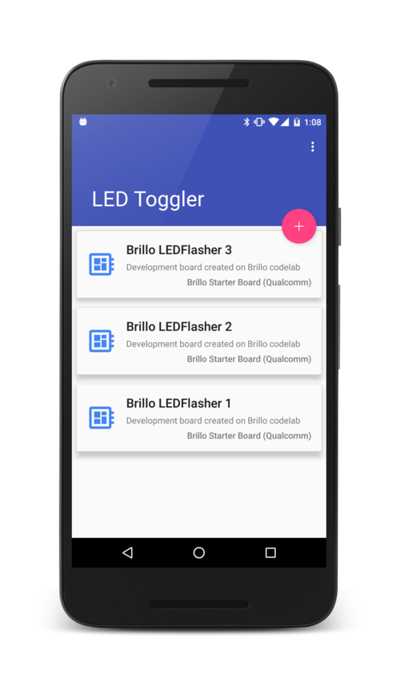
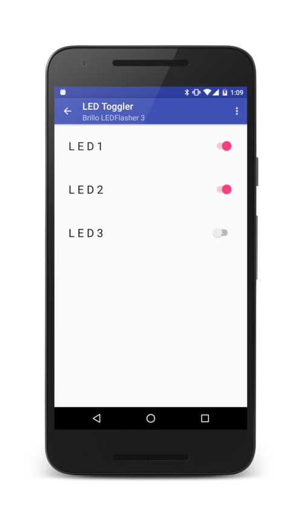

# Weave LED Toggler Quickstart
Demonstrates basic usage of the Weave API to toggle LEDs on a compatible
device.

## Screenshots

## Build
This sample uses the Gradle build system.  To build this project, use the `gradlew build` command
or import the project into Android Studio.

## Run
To run this sample you will need at least one Android device and one Weave
compatible device, for example a Brillo development board.

This sample app expects the Weave device to have a `_ledflasher` schema vendor trait.
See [https://developers.google.com/brillo/eap/guides/develop/weave-integration](ledflasher demo)
for a comprehensive guide on how to build a compatible Brillo board.

You also need to go through the "Bootstrapping and registration" flow to
associate the Brillo device with your account.

Turn on the Brillo device and open this application on the Android device.
On the first run, the user will be asked to grant access to each invidual
devices they want to control from the app. Then the app will list each device
detected and authorized. When the user selects a device, a screen will show
all LEDs exposed by the device, allowing the user to flip each LED on or off.

## Next Steps
Visit [https://developers.google.com/weave/]
(https://developers.google.com/weave/) for more information on the Weave API.
